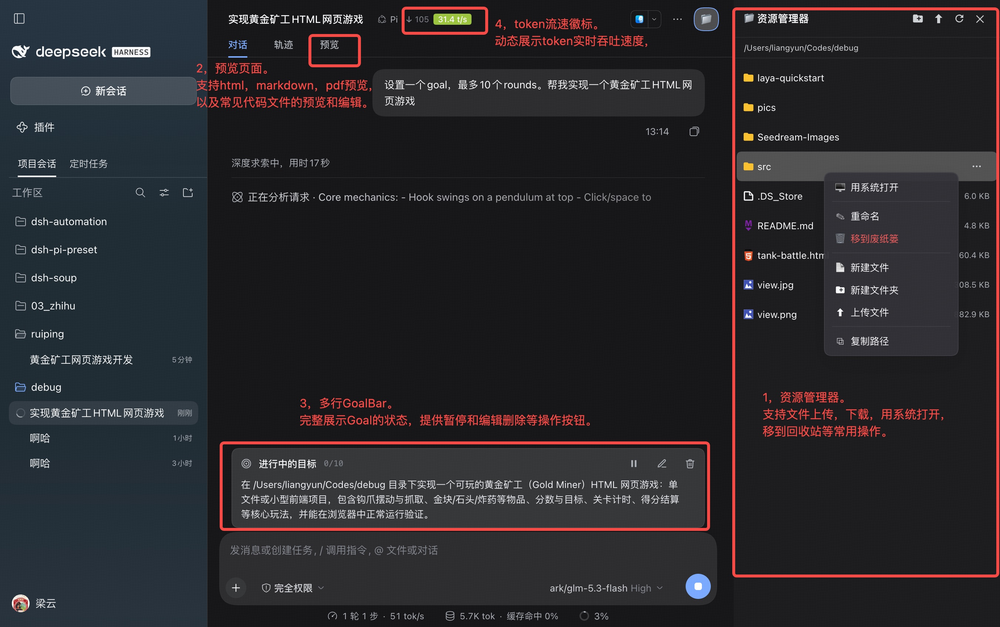

# dsh-soup

> DeepSeek Harness 本身是一大锅汤——营养丰富，但口味平淡。dsh-soup 给它加上点 UI 调料，让它变得美味起来。

## 为什么叫 soup

DSH（DeepSeek Harness）功能很强：会话、工具、轨迹、Goal 一应俱全，营养都在汤里。

但 UI 上略显平淡 —— 默认的右边侧栏不支持文件上传下载、文件预览铺在侧栏不在中间不够自然、模型在跑你却看不到实时速度、长一点的目标被截成一行省略号。

**dsh-soup** 不重写 DSH，而是像下厨一样给这锅汤加几样调料：

- 🧅 **葱** —— JupyterLab风格的右侧文件树，提供 文件上传，下载，删除，系统打开等常用操作。
- 🫚 **姜** —— 会话中间「预览」tab，支持 Markdown / HTML / 图片 / PDF 等常见格式预览，代码等常见文本格式还可编辑。
- 🧄 **蒜** —— 多行 GoalBar，味重提味，把那条总被截断的目标条熬成完整一行行；
- 🧂 **盐** —— 顶部的实时 `t/s` 速率徽标，百味之首，虽小却提味，实时知道模型跑得多快。开车有了仪表盘，推背感立马就上来了。

四样调料，一个插件，三平台通用（macOS / Linux / Windows）。装上之后——DSH 还是那锅汤，只是变得美味了。




## 它能给你什么

### 🧅 右侧文件树（主打 · 葱 · 提鲜点缀）

一个真正和左侧工作区并列的文件浏览器——不悬浮、不遮挡，配色与宽度都与左侧一致（默认 360px，拖左缘在 300–520px 间调整）。

- **跟随会话**：自动展示当前会话的工作目录，切会话/工作区时跟着走。
- **右键菜单**：预览、用系统打开、重命名、移到废纸篓、复制路径、下载；目录多出新建文件、新建文件夹、上传。
- **多选与拖拽**：⌘/Ctrl 加选、Shift 连选；文件拖进目录即移动；系统文件拖入即上传（>1MB 自动分块，带实时进度）。
- **类型图标**：按品牌色区分文件类型（notebook 橙、markdown 紫、json 黄、pdf 红…）。
- **沙箱围栏**：所有文件操作只能落在你的工作区与会话目录内，越界自动拒绝。
- **自动刷新**：每 3 秒轻量探测一次目录签名（mtime），有变化才重拉——agent 或终端里的文件增删改无需手动刷新即可出现；面板关闭且无预览时零开销；宿主不可达（如 DSH 重启中）自动指数退避（封顶 60s）。
- **新建文件夹**：顶部 🗂+ 在当前目录创建文件夹；工具栏顺序为 🗂+ 新建、⬆ 上传、⟳ 刷新、✕ 关闭。
- **一键刷新**：顶部 ⟳ 重拉整个文件树，已展开的子目录保持展开不收起。

### 🫚 会话内文件预览（主打 · 姜 · 去腥增香）

双击文件、或右键「👁 预览」，会话区顶部就会新增一个**「预览」标签页**，和「对话 / 轨迹」同级——看文件不用跳出当前会话。

- **多文件子标签**：单个「预览」tab 内用子标签条管理多个文件，切走再切回内容不丢；最多同时开 5 个，超出按先进先出挤掉最早的。
- **按类型预览**，按类型自动选渲染方式：
  - **Markdown**：渲染为富文本（复用 DSH 聊天同款渲染器）。
  - **HTML**：可交互沙箱（脚本被隔离，碰不到 GUI 的 DOM/存储）。
  - **JSON**：格式化 + 语法着色。
  - **CSV / TSV**：表格视图（引号感知、首行作表头、最多 500 行 × 64 列）。
  - **代码**：常见语言语法高亮（Shiki，主题跟随 DSH 明暗）。
  - **PDF**：浏览器原生查看器（≤20MB，含缩放/搜索）。
  - **Notebook（.ipynb）**：GitHub 风格静态渲染（代码高亮 + 图片/输出内联）。
  - **图片**：png/jpg/gif/webp/svg 等内联展示（≤8MB）。
  - **其余**：二进制给出提示，超大文本截断为纯文本。
- **文本编辑**：Markdown / Python / JavaScript / TypeScript / JSON / HTML / CSS / Shell 等常见文本文件可点「编辑」，支持 ⌘/Ctrl+S 立即保存、未保存标记与返回预览；Python / JSON 等纯代码文件在编辑态保留与预览一致的左侧行号与语法配色，Markdown 返回预览时展示当前草稿。
- **自动保存**：参考 VS Code `files.autoSaveDelay`，停止输入 5 秒后自动保存；退出编辑时也会保存。`⌘S / Ctrl+S` 保存成功后工具栏会短暂显示“已保存”。编辑态默认覆盖磁盘上的其他更改，工具栏不显示保存/取消按钮。
- **跟随会话**：切到别的项目时，范围外的预览自动关闭。
- **自动重读**：正在看的文件被外部（agent / 编辑器）修改时，预览内容几秒内自动更新；若你正在编辑，则保留草稿并提示冲突。

### 🧄 多行 GoalBar（附赠 · 蒜 · 味重提味）

把 DSH 原生那条总是被截断成一行、末尾 `…` 的 GoalBar，放开成**多行完整显示**，编辑控件也从单行 `input` 换成 `textarea`。

- **数据与工具完全复用原生**：goal 的增删改查仍走 DSH 原生 `create_goal` / `get_goal` / `update_goal`，不替换、不遮蔽数据。
- **操作一致**：暂停 / 恢复 / 编辑 / 清除按钮与原生 GoalBar 相同；编辑时 `Ctrl/⌘ + Enter` 保存、`Esc` 取消。
- **不改 DSH 源码**：以更低优先级遮蔽默认实现，主题跟随桌面明暗。

### 🧂 模型实时速率徽标（附赠 · 盐 · 百味之首）

会话头部、Agent 预设标签右侧的一枚小徽标，模型生成时出现、结束自动消失——让你对「现在到底在等还是在跑、跑得多快」有直观感受。

- **等待阶段**：灰色「正在等待模型...」（省略号 1→2→3 原地循环）。
- **流式阶段**：token 计数 + 彩色 `t/s` 速率（≥50 青 / ≥30 绿 / ≥15 黄 / 其余红）。
- **数据可信**：来自模型真实流（不是浏览器端估算）；用近 2 秒滑动窗口算瞬时速率，中途停顿会回到等待态，不会被摊成个位数。
- **只看当前会话**：徽标只呈现当前会话的输出速率；后台任务或别的会话在跑，不会串到当前会话的徽标上。

---

## 安装

> 需要 DSH Desktop（或任何支持 `dsh plugin add` 的 DSH 安装）。

```sh
dsh plugin add @lyhue1991/dsh-soup
```

或在 DSH Desktop「设置 → 插件 → 插件市场」搜索 **dsh-soup** 安装。安装后**重启 DSH** 即可生效。

## 上手

- **打开文件树**：点击 Session log 右侧的 📁；空白新会话则在输入框上方右端找 📁。
- **预览文件**：在文件树里双击文件，或右键选「👁 预览」。
- **看速率**：向任意会话发一条消息，顶部状态栏即出现徽标。
- **多行 GoalBar**：创建 goal 后自动以多行展示。

## 开发

宿主半区纯 JS；浏览器半区由 esbuild 打包（产物 `lib/client.js` 勿手编）。需要 Node ≥ 22。

- `lib/index.js` — 宿主入口：注册 `/api/dsh-soup` 路由（文件操作 + 速率查询），组装各供给器。
- `lib/client/` — 浏览器半区模块（文件树、预览、速率徽标、多行 GoalBar、i18n、样式等）。
- `lib/host/` — 宿主半区模块（路径围栏、文件读写、资源路由、速率跟踪、系统打开）。
- `lib/client.js` — 打包产物（`npm run build` 生成）。
- `cordis.patch.yml` — 在组合中插入 `ui-dsh-soup`。
- `skills/debug-dsh-plugin/` — DSH 插件调试技能（CDP 探针、安全重启脚本）。

```sh
git clone https://github.com/lyhue1991/dsh-soup.git
cd dsh-soup
npm install
```

```sh
npm run build   # esbuild 打包 lib/client.entry.js → lib/client.js
npm test        # build + node --test（客户端静态断言/渲染测试 + 宿主 RPC 冒烟）
```

## 许可证

[MIT](LICENSE)
